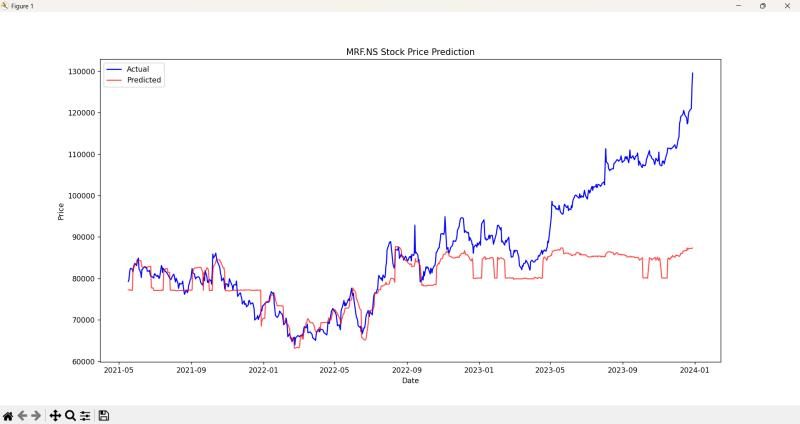

# 📈 Stock Prediction Model


A machine learning project that forecasts stock prices using historical data and market trends. This model processes stock market data, applies predictive algorithms, and generates insights to assist traders and investors in making informed decisions.

---

## 🚀 Key Features

- ✅ **Data preprocessing & feature engineering** for improved accuracy
- ✅ **Predictive modeling** using advanced ML techniques (e.g., XGBoost)
- ✅ **Evaluation metrics** to measure and compare model performance
- ✅ **Real-time trend analysis** and visualizations for better insights

---

## 🛠️ Technologies & Skills Used

- **Python** (Programming Language)
- **pandas**, **NumPy** for data processing
- **yfinance** for fetching historical stock data
- **Scikit-Learn**, **XGBoost** for ML modeling
- **Matplotlib**, **Seaborn** for plotting and visualization

---

## 📂 How to Use

1. **Clone this repository**
   ```bash
   git clone https://github.com/tarun0714/Stock_prediction_model.git
   cd Stock_prediction_model
   ```

2. **Install dependencies**
   ```bash
   pip install -r requirements.txt
   ```

3. **Add your stock data CSV** (or use yfinance to fetch data directly in the script)

4. **Run the model**
   ```bash
   python xgboost_model.py
   ```

---

## 📊 Example

Here's a sample of how to use the model in Python:

```python
import pandas as pd
from xgboost_model import StockPredictor

data = pd.read_csv('AAPL.csv')
model = StockPredictor()
model.train(data)
predictions = model.predict(data)
print(predictions.head())
```

The output plot below compares actual and predicted stock prices:



---

## 💡 What I Learned

This project deepened my understanding of financial markets, data science, and predictive analytics. Excited to explore further advancements in this domain!

---

> _If you find this project useful, feel free to star the repo or connect with me on [GitHub](https://github.com/tarun0714)!_
